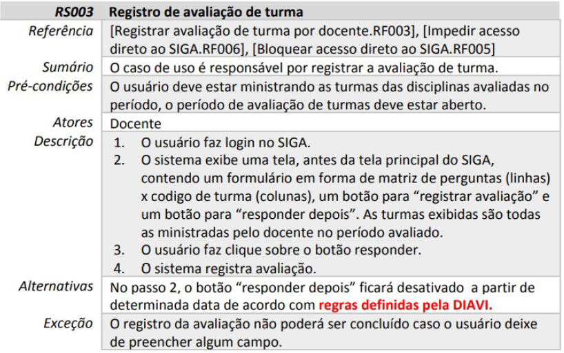

# Engenharia de Software
## Anotações da Aula
### Data: 26/08/2025

---

## Modelo de processo

- Um conjunto estruturado de atividade necessárias para desenvolve rum sistema de software.
- Especificação -> Implementação -> Validação -> Evolução
- **Um modelo de processo de software é uma representação abstrata do processo.**

### Processo de software
    - Modelo Cascata (Clássico)
        - Fases separadas e distintas de especificação e desenvolvimento.
    - Prototipação e espiral
        - Especificação e desenvolvimento dão intercalados.

#### Modelos Cascata
- Um dos principais modelos (Royce, 1970);
- O desenvolvimento de um estágio deve acabar antes da outra começar;
- Simples, mas não reflete como é desenvolvido o software;
- Derivado do mundo do Hardware.

- Estabelecer os requisitos básicos para todos elementos que envolve o software, como hardware, pessoas e banco de dados;
- Exige uma intensa comunicação entre o analista e o cliente;
- Faz parte da análise do sistema;

1. Análise dos requisitos
Intensifica a coleta de requisitos, identificando funções necessárias e desenpenho e interfaces exigidas. Logo, são documentados e revisto com o cliente. Produz a especificação dos requisitos e faz parte da análise do sistema.
- Esse processo é chamado de **Engenharia de Requisitos (ER)**, envolvendo criatividade, interação de pessoas, conhecimento e experiência;
- Esse processo é fundamental, pois possibilita estimar custos e prazos de desenvolvimento de maneira mais precisa.
- **Dentro poblemas, temos:**
    - requisitos inconsistentes,
    - produto final com custo maior do que o esperado,
    - software instável e com altos custos de manutenção,
    - clientes insatisfeitos.
- **Benefícios:**
    - menor quantidade de defeitos,
    - redução de trabalho,
    - menos desenvolvimento desnecessário,
    - diminuição de custos,
    - desenvolvimento mais rápido,
    - menos problema de comunicação,
    - estimativas mais confiáveis,
    - alteração de escopos reduzidas,
    - estimativas mais confiáveis.

# Tipos de requisitos

## Requisitos Funcionais (RF)
- Descrevem o que o sistema deve fazer, especificando comportamentos e funções.
- **Exemplos:**
    - RF 001 - O Sistema deve listar todos os alunos cadastrados em uma turma.
    - RF 002 - O Sistema deve calcular a média dos alunos da turma.

## Requisitos de Qualidade ou Não Funcionais (RNF)
- Expressam restrições ou limites que o sistema deve ter ou qualidades especificas que o sistema deve possuir.
- **Exemplos:**
    - RNF 1: O Sistema deve emitir o relatório da média dos alunos em no máximo 5 segundos;
    - RNF 2: O Sistema deve ser executado no Sistema Operacional Windows 7 ou superior e Linux Ubuntu;
    - RNF 3: O produto será desenvolvido para máquinas com pelo menos 1 GB de Ram.
- *Onde mais aparecem os RNF?*
    - Critérios de Usabilidade;
    - Desempenho;
    - Segurança;
    - Restrições de Hardware e Software;
    - Questões sobre padronização e normatização;
    - Questões de distribuição e instalação.

## Requisitos de Negócio (RNE)
- Descrevem como uma dada funcionalidade ser realizada.
- **Exemplos:**
    - RNE 1: A média para aprovação na instituição é 6;
    - RNE 2: Um professor pode lecionar em uma turma e ser aluno em outra.
---
**Os requisitos detectados devem ser claros, bem descritos, sem ambiguidade e implementáveis.**
---
# Como documentar o levantamento de requisitos
- Deve registrar o tipo do requisito, e a prioridade (Essencial, Importante ou Desejável);

